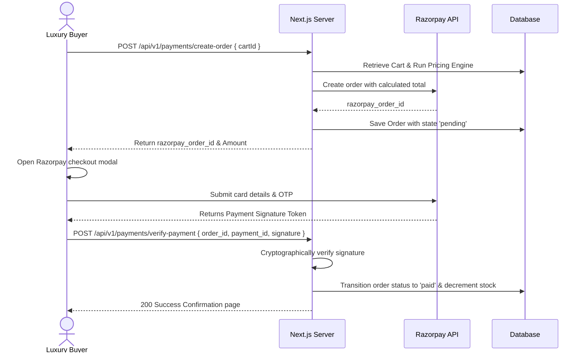

# Luxury Jewellery Backend Architecture Design (Next.js & MongoDB)

This document details the production-ready backend architecture for **MIP Jewellers**, a high-end luxury jewellery eCommerce platform. The design balances Next.js App Router API Route patterns with the complex requirements of high-value luxury retail (dynamic gold pricing, secure transactions, item personalization, store visits, and premium security controls).

---

## 1. Core Business Rules (Tanishq & Bhima Gold Style)

Jewellery eCommerce differs fundamentally from standard retail due to the volatility of precious metal rates and custom metal/gemstone specifications.

### Dynamic Pricing Equation
Precious metal jewellery pricing is calculated dynamically at the time of cart addition/checkout:
$$\text{Product Price} = (\text{Metal Weight} \times \text{Live Metal Rate}) + \text{Making Charges} + \text{Gemstone Value} + \text{GST (3\%)}$$
- **Live Metal Rate**: Updated via cron job/API every 15-60 minutes depending on London Bullion Market Association (LBMA) or local market indices.
- **Making Charges**: Charged either as a percentage of the metal value or a flat per-gram rate.
- **Gemstone Value**: Diamonds, rubies, and pearls have fixed pricing based on carat, clarity, color, and cut (4Cs).
- **GST**: Standard taxation of 3% on precious metals in India.

---

## 2. Next.js Modular Folder Structure

Next.js App Router serves both frontend rendering and backend API routes. The folder structure below segregates concern areas cleanly to support modular, testable, and scalable developments.

```text
client/
├── src/
│   ├── app/
│   │   ├── api/                  # REST API Routing Layer
│   │   │   ├── auth/             # next-auth / custom auth route handlers
│   │   │   ├── v1/
│   │   │   │   ├── products/     # /api/v1/products
│   │   │   │   │   ├── [id]/     # /api/v1/products/[id]
│   │   │   │   │   │   └── route.js
│   │   │   │   │   └── route.js
│   │   │   │   ├── categories/   # /api/v1/categories
│   │   │   │   ├── collections/  # /api/v1/collections
│   │   │   │   ├── cart/         # /api/v1/cart
│   │   │   │   ├── wishlist/     # /api/v1/wishlist
│   │   │   │   ├── checkout/     # /api/v1/checkout
│   │   │   │   ├── orders/       # /api/v1/orders
│   │   │   │   ├── payments/     # /api/v1/payments (order-creation & webhooks)
│   │   │   │   ├── reviews/      # /api/v1/reviews
│   │   │   │   ├── stores/       # /api/v1/stores (Store Locator)
│   │   │   │   └── gold-rates/   # /api/v1/gold-rates
│   │   │   └── middleware.js     # Global API Middleware
│   │   └── ...
│   ├── backend/                  # Core Server-Side Logic (No Next.js dependencies)
│   │   ├── controllers/          # Business logic coordinators (thin layer)
│   │   ├── services/             # Core database queries, API integrations (Razorpay, Cloudinary)
│   │   ├── models/               # Mongoose schemas & indexes
│   │   ├── middlewares/          # API Route level validations, role guards
│   │   ├── config/               # Database connection, SDK clients (Cloudinary, Razorpay)
│   │   └── utils/                # Helper libraries (pricing calculations, error classes)
```

---

## 3. Database Entity Relationship & Mongoose Models

Precious metals require rich relational representation. The following models outline schemas with indexing strategies for fast lookup.

### 3.1. Database Connection Utility (`backend/config/dbConnect.js`)
Next.js serverless execution requires caching the mongoose connection globally to avoid exceeding database connection pools on hot reloads.

```javascript
import mongoose from 'mongoose';

const MONGODB_URI = process.env.MONGODB_URI;

if (!MONGODB_URI) {
  throw new Error('Please define the MONGODB_URI environment variable');
}

let cached = global.mongoose;

if (!cached) {
  cached = global.mongoose = { conn: null, promise: null };
}

export default async function dbConnect() {
  if (cached.conn) {
    return cached.conn;
  }

  if (!cached.promise) {
    const opts = {
      bufferCommands: false,
      maxPoolSize: 10, // Optimize for serverless scaling
    };

    cached.promise = mongoose.connect(MONGODB_URI, opts).then((mongooseInstance) => {
      return mongooseInstance;
    });
  }
  
  try {
    cached.conn = await cached.promise;
  } catch (e) {
    cached.promise = null;
    throw e;
  }

  return cached.conn;
}
```

### 3.2. Mongoose Schemas

#### User Model (`backend/models/User.js`)
```javascript
import mongoose from 'mongoose';

const AddressSchema = new mongoose.Schema({
  tag: { type: String, enum: ['home', 'work', 'other'], default: 'home' },
  street: { type: String, required: true },
  city: { type: String, required: true },
  state: { type: String, required: true },
  pincode: { type: String, required: true, match: /^[0-9]{6}$/ },
  isDefault: { type: Boolean, default: false }
});

const UserSchema = new mongoose.Schema({
  name: { type: String, required: true, trim: true },
  email: { type: String, required: true, unique: true, index: true, lowercase: true },
  password: { type: String, required: true }, // Hashed
  phone: { type: String, unique: true, index: true, required: true },
  role: { type: String, enum: ['customer', 'sales-rep', 'admin'], default: 'customer' },
  addresses: [AddressSchema],
  isEmailVerified: { type: Boolean, default: default: false },
  refreshToken: { type: String }
}, { timestamps: true });

export default mongoose.models.User || mongoose.model('User', UserSchema);
```

#### Gold Rate Tracker (`backend/models/GoldRate.js`)
Stores live metal prices per gram to feed the pricing calculation engine.
```javascript
import mongoose from 'mongoose';

const GoldRateSchema = new mongoose.Schema({
  metal: { type: String, enum: ['gold', 'silver', 'platinum'], required: true },
  purity: { type: String, enum: ['18KT', '22KT', '24KT', '950PT'], required: true }, // Carat purity
  pricePerGram: { type: Number, required: true }, // Current raw metal price
  currency: { type: String, default: 'INR' }
}, { timestamps: true });

// Compound index for unique quick fetch
GoldRateSchema.index({ metal: 1, purity: 1 }, { unique: true });

export default mongoose.models.GoldRate || mongoose.model('GoldRate', GoldRateSchema);
```

#### Product Model (`backend/models/Product.js`)
Jewellery specifications demand tracking metal types, weight, purity, making charges, and diamond grading.
```javascript
import mongoose from 'mongoose';

const GemstoneSchema = new mongoose.Schema({
  type: { type: String, enum: ['diamond', 'ruby', 'emerald', 'sapphire', 'pearl'], required: true },
  carat: { type: Number, required: true }, // Weight of gems
  clarity: { type: String, enum: ['FL', 'IF', 'VVS1', 'VVS2', 'VS1', 'VS2', 'SI1', 'SI2', 'I1'] },
  color: { type: String, enum: ['D', 'E', 'F', 'G', 'H', 'I', 'J', 'Fancy'] },
  cut: { type: String, enum: ['excellent', 'very_good', 'good', 'fair'] },
  value: { type: Number, required: true } // Static cost of stone
});

const ProductSchema = new mongoose.Schema({
  sku: { type: String, required: true, unique: true, index: true },
  name: { type: String, required: true, trim: true },
  slug: { type: String, required: true, unique: true, index: true },
  description: { type: String, required: true },
  images: [{ type: String, required: true }], // Cloudinary URLs
  category: { type: mongoose.Schema.Types.ObjectId, ref: 'Category', required: true, index: true },
  collectionRef: { type: mongoose.Schema.Types.ObjectId, ref: 'Collection', index: true },
  
  // Jewellery Specific Configurations
  metalType: { type: String, enum: ['gold', 'silver', 'platinum'], required: true },
  metalPurity: { type: String, enum: ['18KT', '22KT', '24KT', '950PT'], required: true },
  metalWeight: { type: Number, required: true }, // In grams
  makingChargeType: { type: String, enum: ['percentage', 'flat_per_gram', 'flat_total'], required: true },
  makingChargeValue: { type: Number, required: true }, // Percentage (e.g. 12) or amount (e.g. 450)
  
  gemstones: [GemstoneSchema],
  
  stock: { type: Number, required: true, default: 1 },
  isActive: { type: Boolean, default: true, index: true }
}, { timestamps: true });

// Text indices for robust searching
ProductSchema.index({ name: 'text', description: 'text', sku: 'text' });

export default mongoose.models.Product || mongoose.model('Product', ProductSchema);
```

#### Order Model (`backend/models/Order.js`)
Locks in pricing configurations and records payment transactions.
```javascript
import mongoose from 'mongoose';

const OrderItemSchema = new mongoose.Schema({
  product: { type: mongoose.Schema.Types.ObjectId, ref: 'Product', required: true },
  name: { type: String, required: true },
  quantity: { type: Number, required: true, min: 1 },
  metalPurityLocked: { type: String, required: true },
  metalWeightLocked: { type: Number, required: true },
  goldRateLocked: { type: Number, required: true }, // Locked gold rate at purchase
  makingChargesLocked: { type: Number, required: true },
  gemstonesValueLocked: { type: Number, default: 0 },
  finalPriceLocked: { type: Number, required: true } // Price calculated at checkout
});

const OrderSchema = new mongoose.Schema({
  user: { type: mongoose.Schema.Types.ObjectId, ref: 'User', required: true, index: true },
  items: [OrderItemSchema],
  shippingAddress: {
    street: { type: String, required: true },
    city: { type: String, required: true },
    state: { type: String, required: true },
    pincode: { type: String, required: true }
  },
  subTotal: { type: Number, required: true },
  taxAmount: { type: Number, required: true }, // 3% GST
  grandTotal: { type: Number, required: true },
  
  // Payment Integration States
  paymentStatus: { type: String, enum: ['pending', 'authorized', 'captured', 'failed', 'refunded'], default: 'pending' },
  razorpayOrderId: { type: String, required: true, unique: true, index: true },
  razorpayPaymentId: { type: String },
  razorpaySignature: { type: String },
  
  orderStatus: { type: String, enum: ['received', 'processing', 'shipped', 'delivered', 'cancelled'], default: 'received', index: true },
  trackingId: { type: String }
}, { timestamps: true });

export default mongoose.models.Order || mongoose.model('Order', OrderSchema);
```

---

## 4. Live Pricing Engine Services

Dynamic calculation is handled in a centralized business service to guarantee pricing integrity across the Cart, Favourites, and Checkout APIs.

```javascript
// backend/services/pricingService.js
import GoldRate from '../models/GoldRate';

export async function calculateLiveProductPrice(product) {
  // 1. Fetch locked precious metal rate
  const rateRecord = await GoldRate.findOne({ 
    metal: product.metalType, 
    purity: product.metalPurity 
  });
  
  if (!rateRecord) {
    throw new Error(`Pricing database offline: Live rate for ${product.metalPurity} ${product.metalType} not set.`);
  }

  const liveRate = rateRecord.pricePerGram;
  const rawMetalValue = product.metalWeight * liveRate;
  
  // 2. Making Charges Logic
  let makingCharges = 0;
  if (product.makingChargeType === 'flat_per_gram') {
    makingCharges = product.metalWeight * product.makingChargeValue;
  } else if (product.makingChargeType === 'percentage') {
    makingCharges = rawMetalValue * (product.makingChargeValue / 100);
  } else {
    makingCharges = product.makingChargeValue;
  }

  // 3. Gemstone Valuations
  const gemstoneValue = product.gemstones.reduce((acc, gem) => acc + gem.value, 0);

  // 4. Sum Calculations & Taxation (3% GST)
  const basePrice = rawMetalValue + makingCharges + gemstoneValue;
  const tax = basePrice * 0.03; // GST
  const finalPrice = Math.round(basePrice + tax);

  return {
    rawMetalValue: Math.round(rawMetalValue),
    makingCharges: Math.round(makingCharges),
    gemstoneValue: Math.round(gemstoneValue),
    tax: Math.round(tax),
    finalPrice,
    liveRateUsed: liveRate
  };
}
```

---

## 5. Authentication & Authorization Flow (Auth.js & JWT)

### 5.1. Authentication Architecture

Next.js secures applications using JWT-based token rotation. The implementation validates clients through a secure, HTTP-only Cookie pipeline.

```mermaid
sequenceDiagram
    participant Client as Frontend Client
    participant API as Next.js API Middleware
    participant Auth as JWT Auth Handler
    participant DB as MongoDB

    Client->>Auth: POST /api/v1/auth/login { email, password }
    Auth->>DB: Query User & Verify Password Hash
    DB-->>Auth: User Verified
    Auth->>Auth: Generate AccessToken (JWT) & RefreshToken
    Auth->>DB: Save RefreshToken Hash
    Auth-->>Client: Set HTTP-Only Cookie (AccessToken & RefreshToken)
    Note over Client,API: Subsequent Secured Request
    Client->>API: GET /api/v1/orders
    API->>API: Read Cookies & Verify AccessToken
    alt AccessToken Valid
        API->>DB: Fetch orders
        DB-->>Client: Return orders JSON
    alt AccessToken Expired
        API-->>Client: 401 Unauthenticated / Initiate Silent Refresh
    end
```

### 5.2. Custom API JWT Protection Middleware (`backend/middlewares/authMiddleware.js`)

```javascript
import jwt from 'jsonwebtoken';
import User from '../models/User';
import dbConnect from '../config/dbConnect';

export async function authenticate(req) {
  try {
    await dbConnect();
    
    // Read authorization header or HTTP-only cookies
    const authHeader = req.headers.get('authorization');
    let token = null;

    if (authHeader && authHeader.startsWith('Bearer ')) {
      token = authHeader.split(' ')[1];
    } else {
      // Fallback to cookie verification
      const cookieHeader = req.headers.get('cookie') || '';
      const match = cookieHeader.match(/accessToken=([^;]+)/);
      if (match) token = match[1];
    }

    if (!token) {
      throw new Error('Access token not found');
    }

    const decoded = jwt.verify(token, process.env.JWT_ACCESS_SECRET);
    const user = await User.findById(decoded.userId).select('-password');
    
    if (!user) {
      throw new Error('User record expired');
    }

    return user;
  } catch (error) {
    return null; // Return null so routing layer can handle rejection
  }
}

export function authorizeRoles(...roles) {
  return (user) => {
    if (!user || !roles.includes(user.role)) {
      return false;
    }
    return true;
  };
}
```

---

## 6. Payment Integration Flow (Razorpay)

Security of luxury products requires backend-driven order generation and strict cryptographic verification of signatures before updating shipping registers.



### 6.1. Payments API Implementation Route (`src/app/api/v1/payments/create-order/route.js`)

```javascript
import { NextResponse } from 'next/server';
import Razorpay from 'razorpay';
import dbConnect from '@/backend/config/dbConnect';
import Cart from '@/backend/models/Cart';
import Order from '@/backend/models/Order';
import { authenticate } from '@/backend/middlewares/authMiddleware';
import { calculateLiveProductPrice } from '@/backend/services/pricingService';

const razorpay = new Razorpay({
  key_id: process.env.RAZORPAY_KEY_ID,
  key_secret: process.env.RAZORPAY_KEY_SECRET,
});

export async function POST(req) {
  try {
    await dbConnect();
    const user = await authenticate(req);
    if (!user) {
      return NextResponse.json({ error: 'Unauthorized login required' }, { status: 401 });
    }

    const { cartId, shippingAddress } = await req.json();
    
    // 1. Fetch Cart Details
    const cart = await Cart.findOne({ user: user._id }).populate('items.product');
    if (!cart || cart.items.length === 0) {
      return NextResponse.json({ error: 'Empty shopping cart' }, { status: 400 });
    }

    // 2. Perform Dynamic Pricing verification against current DB rates
    let subTotal = 0;
    const orderItems = [];

    for (const item of cart.items) {
      const calculation = await calculateLiveProductPrice(item.product);
      const itemTotal = calculation.finalPrice * item.quantity;
      
      subTotal += itemTotal;
      orderItems.push({
        product: item.product._id,
        name: item.product.name,
        quantity: item.quantity,
        metalPurityLocked: item.product.metalPurity,
        metalWeightLocked: item.product.metalWeight,
        goldRateLocked: calculation.liveRateUsed,
        makingChargesLocked: calculation.makingCharges,
        gemstonesValueLocked: calculation.gemstoneValue,
        finalPriceLocked: calculation.finalPrice
      });
    }

    const taxAmount = Math.round(subTotal * 0.03); // 3% GST
    const grandTotal = subTotal + taxAmount;

    // 3. Initiate Order creation request inside Razorpay Portal
    const rpOptions = {
      amount: grandTotal * 100, // Amount in paise
      currency: 'INR',
      receipt: `receipt_order_${Date.now()}`,
    };

    const rpOrder = await razorpay.orders.create(rpOptions);

    // 4. Persist pending order to database
    const localOrder = new Order({
      user: user._id,
      items: orderItems,
      shippingAddress,
      subTotal,
      taxAmount,
      grandTotal,
      razorpayOrderId: rpOrder.id,
      paymentStatus: 'pending'
    });

    await localOrder.save();

    return NextResponse.json({
      success: true,
      razorpayOrderId: rpOrder.id,
      amount: rpOrder.amount,
      currency: rpOrder.currency,
      orderId: localOrder._id
    });
  } catch (error) {
    return NextResponse.json({ error: error.message }, { status: 500 });
  }
}
```

### 6.2. Signature Verification Engine (`src/app/api/v1/payments/verify-payment/route.js`)

```javascript
import { NextResponse } from 'next/server';
import crypto from 'crypto';
import dbConnect from '@/backend/config/dbConnect';
import Order from '@/backend/models/Order';
import Cart from '@/backend/models/Cart';
import Product from '@/backend/models/Product';
import { authenticate } from '@/backend/middlewares/authMiddleware';

export async function POST(req) {
  try {
    await dbConnect();
    const user = await authenticate(req);
    if (!user) {
      return NextResponse.json({ error: 'Unauthorized session' }, { status: 401 });
    }

    const { razorpayOrderId, razorpayPaymentId, razorpaySignature } = await req.json();

    // 1. Re-generate Signature locally to match Razorpay's expectations
    const body = razorpayOrderId + '|' + razorpayPaymentId;
    const expectedSignature = crypto
      .createHmac('sha256', process.env.RAZORPAY_KEY_SECRET)
      .update(body.toString())
      .digest('hex');

    const isSignatureValid = expectedSignature === razorpaySignature;

    if (!isSignatureValid) {
      return NextResponse.json({ error: 'Cryptographic payment verification failed' }, { status: 400 });
    }

    // 2. Fetch order and transition state
    const order = await Order.findOne({ razorpayOrderId });
    if (!order) {
      return NextResponse.json({ error: 'Reference transaction order not found' }, { status: 404 });
    }

    order.paymentStatus = 'captured';
    order.razorpayPaymentId = razorpayPaymentId;
    order.razorpaySignature = razorpaySignature;
    order.orderStatus = 'received';
    await order.save();

    // 3. Decrement Inventory levels on purchased items
    for (const item of order.items) {
      await Product.findByIdAndUpdate(item.product, {
        $inc: { stock: -item.quantity }
      });
    }

    // 4. Clear User Shopping Cart
    await Cart.findOneAndDelete({ user: user._id });

    return NextResponse.json({ success: true, message: 'Payment successfully captured' });
  } catch (error) {
    return NextResponse.json({ error: error.message }, { status: 500 });
  }
}
```

---

## 7. Client-Side API Endpoint Specifications

The backend handles client requests via RESTful routes. The tables below map resources to HTTP methods.

| Module | Endpoint | Method | Authentication | Purpose |
| :--- | :--- | :--- | :--- | :--- |
| **Products** | `/api/v1/products` | `GET` | Public | List products (paginated, with filters) |
| | `/api/v1/products/[id]` | `GET` | Public | Detailed product details & live calculations |
| **Categories**| `/api/v1/categories` | `GET` | Public | List taxonomy nodes for main menus |
| **Collections**| `/api/v1/collections`| `GET` | Public | Luxury seasonal lines (e.g. Bridal Festive) |
| **Cart** | `/api/v1/cart` | `GET` | Authenticated | Retrieve persistent shopping cart |
| | `/api/v1/cart/items` | `POST`| Authenticated | Append product to cart |
| | `/api/v1/cart/items/[id]`| `PUT`/`DELETE`| Authenticated | Modify quantities or remove items |
| **Wishlist** | `/api/v1/wishlist` | `GET` | Authenticated | Read wishlisted items |
| | `/api/v1/wishlist` | `POST`| Authenticated | Add/remove items toggle |
| **Orders** | `/api/v1/orders` | `GET` | Authenticated | Customer's transaction history |
| | `/api/v1/orders/[id]` | `GET` | Authenticated | Tracking detail view |
| **Reviews** | `/api/v1/reviews` | `POST`| Authenticated | Review write-up (Verified Purchase) |
| **Locator** | `/api/v1/stores` | `GET` | Public | Store locations with geospatial distance |

### Implementation Checklist
- [x] Create database connection utility (`dbConnect.js`)
- [x] Implement Mongoose models (`User`, `Product`, `Category`, `GoldRate`, `Cart`, `Order`, `Store`)
- [x] Implement core backend services and middleware (`pricingService.js`, `authMiddleware.js`)
- [x] Implement Authentication API route handlers (`/api/v1/auth`)
- [x] Implement Gold Rates API route handler (`/api/v1/gold-rates`)
- [x] Implement Products search/list and details API route handlers (`/api/v1/products`)
- [x] Implement Shopping Cart persistence API route handler (`/api/v1/cart`)
- [x] Implement Store Locator geospatial query API route handler (`/api/v1/stores`)
- [x] Implement Payments order creation and validation API route handlers (`/api/v1/payments`)
- [x] Validate compilation and resolve ESLint errors.

### Store Locator Geospatial Querying
The store model stores GeoJSON locations to return nearby showrooms based on user coordinates.

```javascript
// backend/services/storeService.js
import Store from '../models/Store';

export async function findNearbyStores(lng, lat, maxDistanceInMeters = 50000) {
  return await Store.find({
    location: {
      $near: {
        $geometry: {
          type: 'Point',
          coordinates: [parseFloat(lng), parseFloat(lat)]
        },
        $maxDistance: maxDistanceInMeters
      }
    }
  });
}
```

---

## 8. Cloudinary Media Asset Pipeline

Jewellery assets must render in high definition. The design utilizes Cloudinary's dynamic optimization pipelines to serve responsive images.

### Pipeline Logic
- **Upload Flow**: Admins upload 4K raw images. The backend intercept pushes raw binary formats to Cloudinary.
- **Dynamic Delivery**: The client requests images using responsive URL queries.
  - *List view*: `https://res.cloudinary.com/mip/image/upload/w_400,c_fill,g_auto,q_auto,f_auto/v1/products/ring.jpg`
  - *Detail view*: `https://res.cloudinary.com/mip/image/upload/w_1200,c_limit,q_auto,f_auto/v1/products/ring.jpg`
- **Dynamic parameter glossary**:
  - `q_auto`: Automatically adjusts quality to optimize page load speeds.
  - `f_auto`: Converts images to next-gen formats (WebP, AVIF) based on browser support.
  - `c_fill,g_auto`: Smart cropping centered automatically on the jewel.

---

## 9. Production Security & Scalability Blueprint

### 9.1. DB Indexing Matrix
To maintain fast response times, add the following indices to MongoDB:

```javascript
// Index declarations in model configurations
ProductSchema.index({ category: 1, isActive: 1 });
ProductSchema.index({ metalType: 1, metalPurity: 1 });
OrderSchema.index({ user: 1, createdAt: -1 });
UserSchema.index({ email: 1 }, { unique: true });
```

### 9.2. Rate Limiting Middleware
Vercel Edge or API route limits using **Upstash Redis** (or a sliding window log memory cache) to prevent DDoS attacks on login and payment routes:

```javascript
import { Ratelimit } from "@upstash/ratelimit";
import { Redis } from "@upstash/redis";

const redis = new Redis({
  url: process.env.UPSTASH_REDIS_REST_URL,
  token: process.env.UPSTASH_REDIS_REST_TOKEN,
});

// Limit to 5 checkout attempts per 10 minutes per IP
export const checkoutLimiter = new Ratelimit({
  redis,
  limiter: Ratelimit.slidingWindow(5, "10 m"),
});
```

### 9.3. Input Validations using Zod
Zod schemas prevent invalid or malicious payloads from reaching database controllers:

```javascript
import { z } from 'zod';

export const CheckoutPayloadSchema = z.object({
  cartId: z.string().regex(/^[0-9a-fA-F]{24}$/, 'Invalid Cart ID format'),
  shippingAddress: z.object({
    street: z.string().min(5, 'Street address is too short'),
    city: z.string().min(2),
    state: z.string().min(2),
    pincode: z.string().regex(/^[0-9]{6}$/, 'Must be a valid 6-digit PIN')
  }),
  paymentMethod: z.enum(['online', 'cod'])
});
```

### 9.4. Production Security Headers Configuration
Configure headers in `next.config.js` to protect Vercel environments:

```javascript
const securityHeaders = [
  { key: 'X-DNS-Prefetch-Control', value: 'on' },
  { key: 'Strict-Transport-Security', value: 'max-age=63072000; includeSubDomains; preload' },
  { key: 'X-XSS-Protection', value: '1; mode=block' },
  { key: 'X-Frame-Options', value: 'SAMEORIGIN' },
  { key: 'X-Content-Type-Options', value: 'nosniff' },
  { key: 'Referrer-Policy', value: 'strict-origin-when-cross-origin' }
];

module.exports = {
  async headers() {
    return [{ source: '/:path*', headers: securityHeaders }];
  }
};
```
